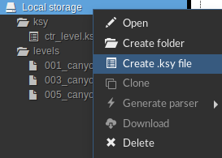
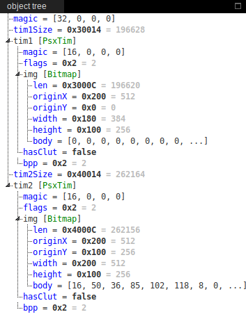

* Go to https://ide.kaitai.io/

* Right click on *Local storage*, *Create .ksy file*

* Paste the content of a *.ksy* file from the `./kaitai-struct/` dir, for example [./kaitai-struct/ctr_tim2x.ksy](./kaitai-struct/ctr_tim2x.ksy).

* At the very bottom, click on upload, and select a corresponding file, for example *142_turbo_relic.vram*

* you should see the parsed data

