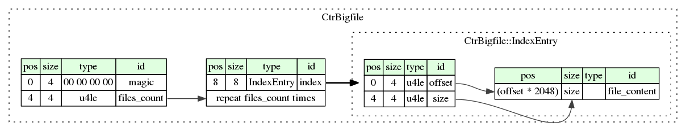
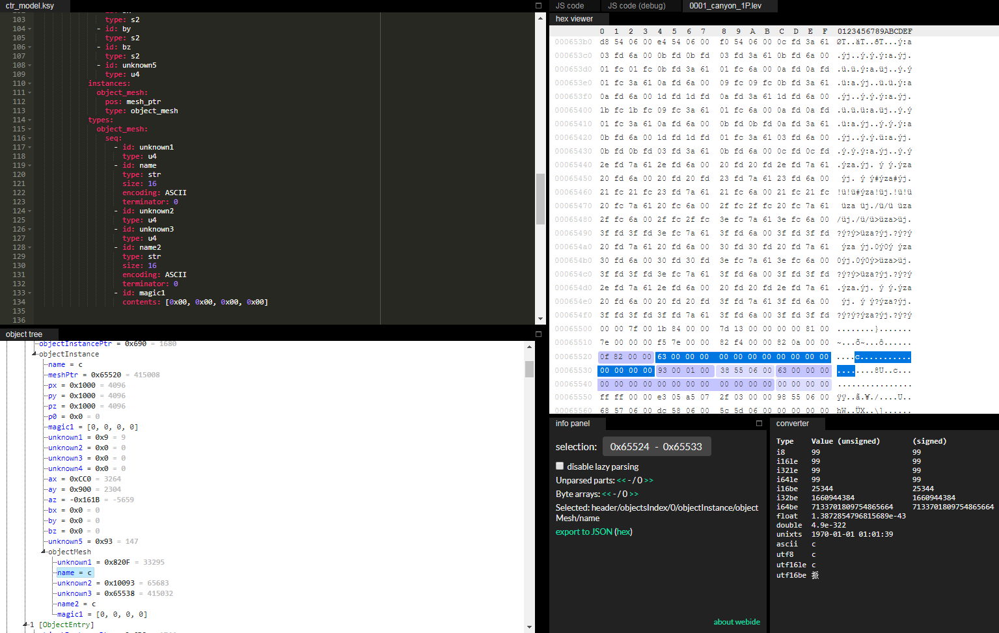
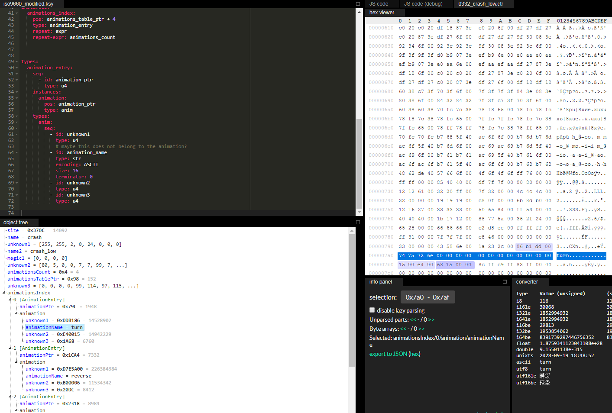

# Introduction
This a library to parse Crash Team Racing data files, some of it is based on [DCxDemo's work](https://github.com/DCxDemo/CTR-tools)

See the [reversing guide](./REVERSING_WALKTHROUGH.md), and the [modding guide](./MODDING_GUIDE.md)

# Status
## Done or mostly done
* [BIGFILE.BIG](./kaitai-struct/ctr_bigfile.ksy)
* [TIM files](./kaitai-struct/psx_tim.ksy)
* [TIM2x](./kaitai-struct/ctr_tim2x.ksy)
* [lang](./kaitai-struct/ctr_lang.ksy)

# Building
## Requirements
* clone this repo

```
git clone https://github.com/tatref/libctr
cd libctr/
```

* Install java
* Install kaitai-struct-compiler-0.8 (see http://kaitai.io/#download for details)

```
wget https://dl.bintray.com/kaitai-io/universal/0.8/kaitai-struct-compiler-0.8.zip
unzip kaitai-struct-compiler-0.8.zip
```

* Install graphviz (optional). For visual block diagrams

## Building the libs
The source for each file format is at `./kaitai-struct`. To build, the Python/Java/... libs from it, just run

```
./create_libs.sh
```

# Formats mapping

|Extension|ksy|Description|
|---|---|---|
|.BIG|[ctr_bigfile.ksy](./kaitai-struct/ctr_bigfile.ksy)|BIGFILE.BIG|
|.vram|[ctr_tim2x.ksy](./kaitai-struct/ctr_tim2x.ksy)|textures|
|.ctr|[ctr_character.ksy](./kaitai-struct/ctr_character.ksy)|characters|
|.lev|[ctr_level.ksy](./kaitai-struct/ctr_level.ksy)|levels|
|.lng|[ctr_lang.ksy](./kaitai-struct/ctr_lang.ksy)|translations|

# Usage
See [examples](./examples)

# Gallery
## [Block diagrams](./graphviz/)


## Web IDE (https://ide.kaitai.io/)
For a tutorial, see [Kaitaistruct_WebIDE_Tutorial](Kaitaistruct_WebIDE_Tutorial.md)

Level


Character



