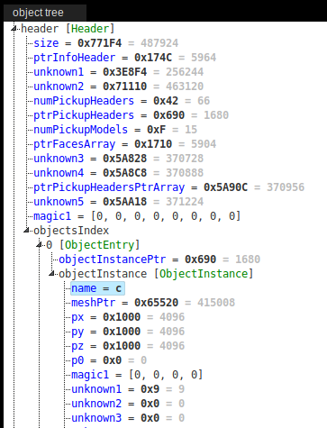

# Setup
Tested on Linux (Debian 8)

Tools required
- python3
- docker
- git

All the other tools (psxrip, libctr...) will be installed locally (no changes made at OS level)

Tested ISOs:
- SCUS-94426 (US)
- SCES-02105 (UE): not filenames yet


# Clone the repo
```bash
git clone https://github.com/tatref/libctr
cd libctr/
```

# Dump the CD
- input: physical CD
- output: binary dump
- tools: dd (standard on Linux)

```bash
dd if=/dev/cdrom of=./data/SCUS-94426.bin bs=4m
```

Create the .CUE file to point to the .bin
```bash
cat <<EOF > ./data/SCUS-94426.cue
FILE "SCUS-94426.bin" BINARY
  TRACK 01 MODE2/2352
    INDEX 01 00:00:00
EOF
```

# Dump the ISO
- input: bin CD
- output: CD content (files)
- tools: psxrip

## Install psxrip
Docker installation (see README.md, or "Releases" on github for other methods, or the original source: https://github.com/cebix/psximager)
```bash
git clone https://github.com/tatref/psximager
cd psximager/
docker build -t psximager .
docker run --rm -v $PWD/bin:/psximager/bin psximager /bin/bash -c "cd /usr/local/bin/ && cp psxbuild psxinject psxrip /psximager/bin/"
```

You now have `psxrip` at `./bin/psxrip`, you can copy it somewhere in your path
```bash
sudo chown root:root ./bin/*
sudo cp -a ./bin/* /usr/local/bin/
```

## ISO extraction

```bash
psxrip ./data/SCUS-94426.cue ./data/SCUS-94426/
```

This produces the `./data/SCUS-94426/` directory, containing all the ISO files

# BIGFILE.BIG extraction
- input: BIGFILE.BIG
- output: CTR datafiles
- tools: libctr, python, kaitai-struct

The main data file is `BIGFILE.BIG`, it contains the levels, characters...

## Virtualenv setup
```bash
sudo apt install python3-virtualenv
python3 -m venv ./venv
. ./venv/bin/activate
(venv)$ pip install -r requirements.txt
```

## Actual BIGFILE extraction
```bash
./examples/dump_big_file.py ./data/SCUS-94426/BIGFILE.BIG ./data/bigfile.SCUS-94426/
```

All the files will end up in `./data/bigfile.SCUS-94426/`, the list of files (index, name, and md5) will be at `./data/bigfile_SCUS-94426.json`

# Reading datafiles
## Interactive exploration
See [Kaitaistruct_WebIDE](./Kaitaistruct_WebIDE_Tutorial.md)

## Python exploration
IPython is a great tool for programmatic data exploration. First make sure it's installed in your virtualenv

```bash
pip install ipython
ipython
```

Example usage
```python
# to make imports easier
import sys
sys.path.append('./python')

# we will parse some level file
from ctr.ctr_level import CtrLevel


level = CtrLevel.from_file('./data/bigfile.SCUS-94426/001_canyon_1P.lev')
```

To find what attribute is available, use `dir(level)`, you will see the following
```
...
 '_root',
 'close',
 'from_bytes',
 'from_file',
 'from_io',
 'header',                   # <===
 'info_header']              # <===
```

You can see theses in the WebIDE more clearly



Getting some value, and printing some objects

```python
print("header size=", level.header.size)
print("first object name=", level.header.objects_index[0].object_instance.name)
print("first object mesh pointer=", level.header.objects_index[0].object_instance.mesh_ptr)
```

Output
```
header size= 487924
first object name c
first object mesh pointer= 415008
```

That's all for now. More to come!
